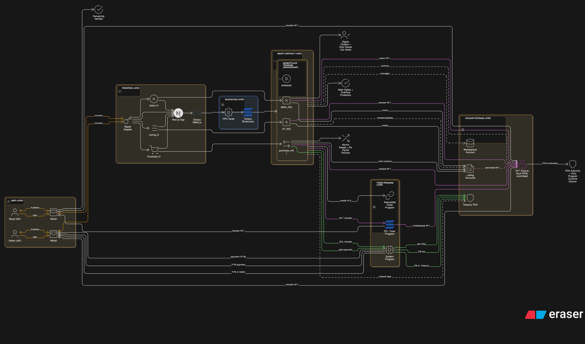
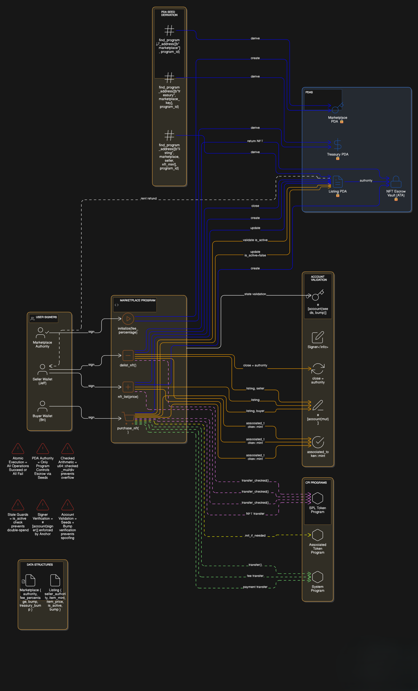

# Solana NFT Marketplace

A decentralized NFT marketplace built on Solana blockchain using the Anchor framework.

---

## Problem Statement: Solving Traditional Trading Issues

#### 🚨 Key Issues:
1. **Scam Risk** - No escrow system means traders must trust strangers with valuable assets
2. **Manual Coordination** - Buyers and sellers must coordinate wallet addresses, amounts, and timing manually
3. **No Price Discovery** - Difficult to determine fair market prices without a central listing system
4. **Double-Sale Risk** - Sellers can list the same NFT to multiple buyers simultaneously
5. **No Dispute Resolution** - When trades go wrong, there's no recourse or protection
6. **Trust Barrier** - Requires trust between parties, limiting trading to known community members
7. **Inefficient Process** - Multi-step process prone to human error
8. **Fee Confusion** - No standardized platform fees or transparent royalty payments

### How This Marketplace Solves These Problems

| Discord Problem | Our Solution |
|----------------|--------------|
| **Manual Trust Required** | Smart contract acts as automatic escrow - NFTs locked until payment received |
| **Scam Vulnerability** | Blockchain-enforced transfers - impossible to receive payment without sending NFT |
| **No Price Transparency** | Public on-chain listings with clear pricing visible to all |
| **Double-Sale Risk** | NFTs physically locked in listing vault - can't be sold twice |
| **Coordination Complexity** | Single transaction handles entire trade atomically |
| **No Fee Standards** | Transparent, immutable marketplace fees set at initialization |
| **Dispute Resolution** | Code is law - smart contract enforces rules automatically |
| **Limited Liquidity** | Open marketplace accessible to anyone, not just Discord members |

---

## User Stories

### Story 1: Jeff Lists His NFT

**Background:** Jeff owns a rare Solana Monkey Business NFT that he wants to sell. Previously, he tried selling on Discord but got scammed when a buyer sent fake tokens.

**Using the Marketplace:**
```
1. Jeff connects his Phantom wallet
2. Jeff selects his NFT and sets a price of 50 SOL
3. The smart contract transfers the NFT to an escrow account
4. Jeff's listing appears publicly on the marketplace
5. Jeff's NFT is locked - he can't accidentally sell it elsewhere
6. Jeff can delist anytime if he changes his mind
```

**Outcome:** Jeff's NFT is safely escrowed on-chain. He doesn't need to trust anyone or coordinate timing. His listing is visible to all potential buyers with guaranteed pricing.

---

### Story 2: Bri Purchases an NFT

**Background:** Bri saw a cool NFT listed on Discord, but the seller wanted payment first. Bri was worried about getting scammed.

**Using the Marketplace:**
```
1. Bri browses marketplace listings
2. Bri finds Jeff's Solana Monkey Business NFT for 50 SOL
3. Bri clicks "Buy Now" and approves the transaction
4. In a SINGLE atomic transaction:
   - Bri's 50 SOL is split: 48.5 SOL to Jeff, 1.5 SOL marketplace fee
   - Jeff's NFT transfers to Bri's wallet
   - Listing is automatically closed
5. Bri immediately owns the NFT - no waiting for Jeff
```

**Outcome:** Bri gets exactly what she paid for, instantly. No trust required. No coordination with Jeff needed. No risk of scams or fake NFTs.

---

### Story 3: Jeff Changes His Mind

**Background:** Jeff listed his NFT for 50 SOL, but now wants to keep it because the floor price increased.

**Using the Marketplace:**
```
1. Jeff navigates to "My Listings"
2. Jeff clicks "Delist" on his NFT
3. Smart contract returns the NFT to Jeff's wallet
4. Listing is closed and removed from marketplace
```

**Outcome:** Jeff has full control. He can reclaim his NFT anytime before someone buys it. The NFT returns safely to his wallet.

---

## Architecture Diagrams

### Overall System Architecture



---

### Smart Contract Program Architecture



---
### Smart Contract Functions

| Function | Who Calls | What It Does |
|----------|-----------|--------------|
| `initialize` | Marketplace Authority | Creates marketplace with fee structure |
| `nft_list` | Seller (Jeff) | Lists NFT for sale with price |
| `purchase_nft` | Buyer (Bri) | Buys listed NFT atomically |
| `delist_nft` | Seller (Jeff) | Removes listing and returns NFT |

---

## 🔑 Key Features

### 🔒 **Trustless Escrow**
- NFTs are held in program-derived addresses (PDAs)
- Smart contract is the sole authority over escrowed assets
- Impossible for sellers to rug pull or double-sell

### ⚡ **Atomic Swaps**
- NFT transfer + SOL payment happen in single transaction
- Either everything succeeds or nothing happens (no partial states)
- Zero counterparty risk

### 💰 **Transparent Fees**
- Configurable marketplace fee (0-100%)
- Fees automatically sent to treasury
- Sellers receive net amount after fees
- All fees visible on-chain

### 🎯 **Secure Listing Management**
- Only original lister can delist their NFT
- Listings can't be modified by unauthorized parties
- Active/inactive status prevents double-spending

### 🛡️ **Built-in Safety Checks**
- Price validation (must be > 0)
- Ownership verification
- Active listing requirements
- Math overflow protection


## 📦 Installation & Setup

### Prerequisites
```bash
- Rust 1.70+
- Solana CLI 1.18+
- Anchor CLI 0.31.1
- Node.js 18+
- Yarn or NPM
```

### 1. Clone Repository
```bash
git clone <repository-url>
cd NFT-MarketPlace
```

### 2. Install Dependencies
```bash
cd marketplace
anchor build
```

### 3. Configure Anchor
```bash
# Update Anchor.toml with your wallet path
wallet = '~/.config/solana/id.json'
```

### 4. Run Local Validator
```bash
solana-test-validator
```

### 5. Deploy Contract
```bash
anchor deploy
```

### 6. Run Tests
```bash
cd tests
npm install
anchor test
```

---


## 📄 License

This project is licensed under the MIT License - see the LICENSE file for details.

---

## 🙋 FAQ

**Q: What happens if the buyer doesn't have enough SOL?**  
A: The transaction fails before any state changes. The listing remains active.

**Q: Can the marketplace authority steal NFTs?**  
A: No. The authority can only modify marketplace settings, not access listings.

**Q: What if Jeff lists the NFT, then transfers it to another wallet?**  
A: The NFT is already in escrow. Jeff no longer owns it until he delists.

**Q: Can fees be changed after initialization?**  
A: Current implementation sets fees at initialization. Upgradeable contracts could add fee modification.

**Q: What happens to rent when a listing is closed?**  
A: Rent is returned to the seller when delisting (via `close = seller_authority`).

---

## Why Solana?

This marketplace leverages Solana's unique advantages:

| Feature | Benefit |
|---------|---------|
| **Speed** | ~400ms transactions = instant trades |
| **Cost** | $0.00025 per transaction vs $50+ on Ethereum |
| **Throughput** | 65,000 TPS = no congestion during high demand |
| **Composability** | Easy integration with other Solana DeFi protocols |
| **Token Standard** | Native SPL token support = seamless NFT handling |

---

**Built with ❤️ on Solana**

*Making NFT trading trustless, transparent, and safe.*

